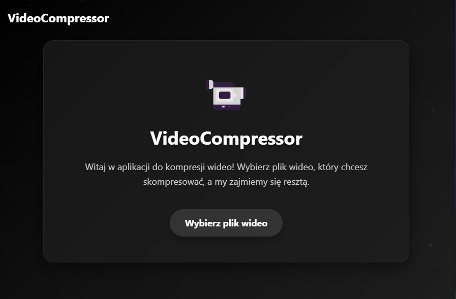

# 🎬 PyVideoCompressor – Aplikacja do kompresji wideo

## 🧠 O co chodzi?

To prosty, graficzny program do kompresji plików wideo w pythonie. Umożliwia:

- wybranie pliku wideo,
- określenie maksymalnego rozmiaru w MB,
- szybkie zmniejszenie wagi pliku z zachowaniem dobrej jakości,
- obserwację postępu procesu
  
## 🧰 Technologie i biblioteki

- `PyQt6` – budowa GUI (okno główne, przyciski, inputy itp.)
- `QtWebEngine` – renderowanie interfejsu w HTML/CSS/JS w oknie aplikacji
- `QWebChannel` – komunikacja między Pythonem a JavaScriptem
- `FFmpeg` i `FFprobe` – narzędzia do kompresji i analizy wideo (wywoływane przez `subprocess`)
- `QThread` – do obsługi procesu kompresji w osobnym wątku (żeby nie blokować GUI)

## 📁 Struktura i działanie aplikacji

1. Uruchomienie aplikacji.
2. Wybór pliku i ustawienie rozmiaru.
3. Kompresja.
4. Gotowe!

## 🎨 Interfejs

Interfejs aplikacji jest nowoczesny, responsywny i zbudowany w HTML + CSS. Zawiera animacje, ciemny motyw i efekt cząsteczek w tle.

## ✅ Wymagania

- Python 3.9+
- PyQt6
- Folder `ffmpeg/bin/` z `ffmpeg(.exe)` i `ffprobe(.exe)` (jest w plikach)

## 🚀 Uruchamianie

Można uruchomić na dwa sposoby:

```bash
python main.py
```

albo:

```bash
venv/Scripts/activate  
python main.py
```

## 📸 Screenshot



